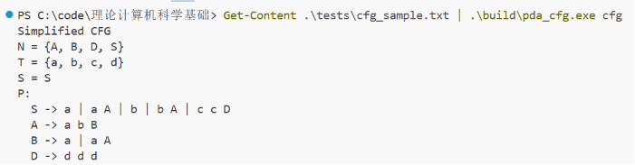
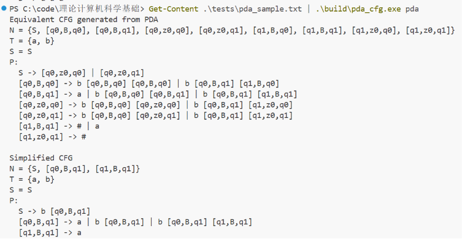
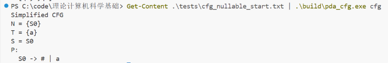

# 理论计算机科学基础实验报告

CFG 与 PDA

学院：待填写

专业：待填写

班级：待填写

成员：

- 待填写
- 待填写
- 待填写

日期：待填写

## 1 实验目的和要求

本实验包括两个内容。

第一部分是编写上下文无关文法的变换程序。程序读入一个上下文无关文法后，依次消除其中的 `epsilon` 产生式、单产生式和无用符号，并保持文法生成的语言不变。

第二部分是编写 PDA 到 CFG 的转换程序。程序根据输入的下推自动机构造等价 CFG，再调用第一部分的化简程序处理该 CFG。

实验要求程序能正确读取输入并输出可检查的结果。报告中记录实验环境、程序设计思路、核心算法、输入输出格式、测试结果和小组分工。

## 2 实验环境

操作系统：Windows 11

编程语言：C++17

开发工具：Visual Studio Code

编译器：MinGW g++ 8.1.0

编译命令：

```powershell
g++ -std=c++17 -Wall -Wextra -pedantic .\src\main.cpp .\src\cfg.cpp .\src\pda.cpp -o .\build\pda_cfg.exe
```

## 3 成员及分工

成员A（待填写）：`epsilon` 产生式消除、PDA 到 CFG 转换。

成员B（待填写）：单产生式消除、文法数据结构、主程序流程。

成员C（待填写）：无用符号消除、联合调试、测试记录。

## 4 实验需求

### 4.1 上下文无关文法变换

程序读入一个上下文无关文法 `G = (N, T, P, S)`，其中 `N` 是非终结符集合，`T` 是终结符集合，`P` 是产生式集合，`S` 是开始符号。

文法变换部分完成以下操作：

1. 消除 `epsilon` 产生式。
2. 消除单产生式。
3. 删除无用符号。

本实验中使用 `#` 表示空串。老师给出的 CFG 样例为：

```text
S -> a | b A | B | c c D
A -> a b B | #
B -> a A
C -> d d C
D -> d d d
```

### 4.2 PDA 到 CFG 转换

程序还读入一个下推自动机：

```text
M = (Q, T, Gamma, delta, q0, z0, F)
```

其中 `Q` 为状态集合，`T` 为输入字母表，`Gamma` 为栈符号集合，`delta` 为转移函数，`q0` 为初始状态，`z0` 为初始栈符号，`F` 为终态集合。

本程序按空栈接受方式处理 PDA，终态集合允许为空。空输入和空压栈串均用 `#` 表示。

老师给出的 PDA 样例为：

```text
delta(q0,b,z0) = {(q0,Bz0)}
delta(q0,b,B)  = {(q0,BB)}
delta(q0,a,B)  = {(q1,epsilon)}
delta(q1,a,B)  = {(q1,epsilon)}
delta(q1,epsilon,B)  = {(q1,epsilon)}
delta(q1,epsilon,z0) = {(q1,epsilon)}
```

## 5 程序设计思路及核心算法

### 5.1 总体设计

程序提供两个运行模式：

```text
1. Simplify CFG
2. Convert PDA to CFG and simplify
```

选择 CFG 模式时，程序读取文法，按顺序执行三步化简，最后输出化简后的 CFG。

选择 PDA 模式时，程序先读取 PDA，根据 PDA 构造等价 CFG，再调用 CFG 化简流程，输出构造出的 CFG 和化简后的 CFG。

程序中的符号类型采用 `string`，可直接保存 `q0`、`z0`、`[q0,B,q1]` 这类多字符符号。PDA 转 CFG 后生成的复杂非终结符不再做额外重命名。

### 5.2 CFG 的数据表示

CFG 中的终结符、非终结符和产生式使用 STL 容器保存。结构如下：

```cpp
struct CFG {
    set<string> nonterminals;
    set<string> terminals;
    string start;
    map<string, set<vector<string>>> productions;
};
```

其中，产生式右部用符号序列表示。右部为空向量时表示空串 `epsilon`。

### 5.3 消除 epsilon 产生式

消除 `epsilon` 产生式时，先计算所有可推出空串的非终结符集合。

具体步骤如下：

1. 找出右部直接为空的产生式，将其左部加入可空集合。
2. 反复扫描产生式，如果某个产生式右部的所有符号都能推出空串，则该左部也加入可空集合。
3. 对每条产生式，枚举右部中可空符号保留或删除的情况，生成新的产生式。
4. 删除普通的空产生式。
5. 如果原开始符号可推出空串，则新增一个开始符号，并保留空串产生式。

处理结束后，除开始符号需要保留空串的特殊情况外，文法中不再含有多余的 `epsilon` 产生式。

### 5.4 消除单产生式

单产生式指形如 `A -> B` 的产生式，其中 `A` 和 `B` 都是非终结符。

程序对每个非终结符 `A` 计算它通过单产生式可到达的非终结符集合。若 `A` 能通过若干步单产生式到达 `B`，并且 `B` 有非单产生式 `B -> alpha`，则把 `A -> alpha` 加入新的产生式集合。最后删除原来的单产生式。

例如，若有：

```text
S -> A
A -> B
B -> a
```

消除单产生式后，`S` 直接推出 `a`。

### 5.5 删除无用符号

无用符号分为两类：

1. 不能推出终结符串的符号。
2. 从开始符号出发无法到达的符号。

程序先计算可推出终结符串的非终结符，删除不能终止的符号和相关产生式。然后从开始符号出发计算可达符号，只保留可达的非终结符、终结符和产生式。

无用符号放在最后删除。前两步处理后，文法中可能出现新的冗余符号。

### 5.6 PDA 到 CFG 的构造

PDA 到 CFG 的转换使用课件中的构造方法。对任意状态 `p`、栈符号 `A` 和状态 `q`，构造非终结符：

```text
[p,A,q]
```

它表示 PDA 从状态 `p` 出发，栈顶为 `A`，读入某一段输入后到达状态 `q`，并弹出栈顶符号 `A`。

开始符号记为 `S`。按空栈接受处理时，对每个状态 `q` 加入：

```text
S -> [q0,z0,q]
```

对 PDA 的每条转移，程序根据压栈串的长度生成 CFG 产生式。

如果转移只弹出栈顶，不再压入新符号：

```text
delta(p, a, A) = (r, epsilon)
```

则加入：

```text
[p,A,r] -> a
```

如果读入符号 `a` 为空输入，则右部不写终结符。

如果转移压入多个栈符号：

```text
delta(p, a, A) = (r, B1 B2 ... Bk)
```

则枚举中间状态，生成形如：

```text
[p,A,qk] -> a [r,B1,q1] [q1,B2,q2] ... [q(k-1),Bk,qk]
```

的产生式。该产生式表示 PDA 后续依次弹出这些栈符号的过程。

## 6 输入输出格式

### 6.1 CFG 输入格式

CFG 输入采用分段形式。`N:` 表示非终结符集合，`T:` 表示终结符集合，`S:` 表示开始符号，`P:` 后输入产生式，最后用 `END` 结束。

```text
N: S A B C D
T: a b c d
S: S
P:
S -> a | b A | B | c c D
A -> a b B | #
B -> a A
C -> d d C
D -> d d d
END
```

### 6.2 PDA 输入格式

PDA 输入中，`Q:` 表示状态集合，`T:` 表示输入符号集合，`G:` 表示栈符号集合，`q0:` 和 `z0:` 分别表示初始状态和初始栈符号，`F:` 表示终态集合，`D:` 后面输入转移函数。

```text
Q: q0 q1
T: a b
G: B z0
q0: q0
z0: z0
F:
D:
q0 b z0 -> q0 B z0
q0 b B -> q0 B B
q0 a B -> q1 #
q1 a B -> q1 #
q1 # B -> q1 #
q1 # z0 -> q1 #
END
```

### 6.3 输出格式

CFG 输出包含非终结符集合、终结符集合、开始符号和产生式集合。

PDA 模式下，程序先输出由 PDA 构造出的 CFG，再输出进一步化简后的 CFG。

## 7 测试及执行效果

### 7.1 CFG 化简测试

输入：

```text
N: S A B C D
T: a b c d
S: S
P:
S -> a | b A | B | c c D
A -> a b B | #
B -> a A
C -> d d C
D -> d d d
END
```

输出：

```text
Simplified CFG
N = {A, B, D, S}
T = {a, b, c, d}
S = S
P:
  S -> a | a A | b | b A | c c D
  A -> a b B
  B -> a | a A
  D -> d d d
```

运行结果中，`A -> #` 被消除，`S -> B` 形式的单产生式被展开，不可达的 `C` 也被删除。



图 1 CFG 化简运行结果

### 7.2 PDA 到 CFG 测试

输入：

```text
Q: q0 q1
T: a b
G: B z0
q0: q0
z0: z0
F:
D:
q0 b z0 -> q0 B z0
q0 b B -> q0 B B
q0 a B -> q1 #
q1 a B -> q1 #
q1 # B -> q1 #
q1 # z0 -> q1 #
END
```

程序先输出由 PDA 构造出的 CFG，其中包含 `[q0,z0,q0]`、`[q0,B,q1]` 等非终结符；之后继续进行 CFG 化简。化简后的结果如下：

```text
Simplified CFG
N = {S, [q0,B,q1], [q1,B,q1]}
T = {a, b}
S = S
P:
  S -> b [q0,B,q1]
  [q0,B,q1] -> a | b [q0,B,q1] | b [q0,B,q1] [q1,B,q1]
  [q1,B,q1] -> a
```

化简结果保留了有效的复合非终结符，空输入转移和空压栈串也得到处理。



图 2 PDA 转 CFG 运行结果

### 7.3 补充测试

另取一组开始符号可推出空串的输入：

```text
N: S A
T: a
S: S
P:
S -> A
A -> a | #
END
```

输出：

```text
Simplified CFG
N = {S0}
T = {a}
S = S0
P:
  S0 -> # | a
```

原文法可推出空串，化简后新增开始符号 `S0`，并保留 `S0 -> #`。



图 3 补充输入运行结果

## 8 调试中遇到的问题

调试过程中遇到的问题如下：

1. 输入文件首行带有 UTF-8 BOM 时，程序无法正确识别 `N:` 或 `Q:`。后来在字符串裁剪函数中加入了 BOM 处理。
2. 兼容紧凑 CFG 输入时，第一行 `SABCD` 曾被整体识别为一个符号。后来改为在没有空格分隔时按单字符拆分。
3. 异常输入测试时，PowerShell 会把错误包装到额外信息中。后来改为直接捕获程序输出，便于观察程序本身的报错。

上述问题修改后，CFG 化简和 PDA 到 CFG 转换均能正常运行。

## 9 改进思路

本实验完成了基本要求，后续改进方向如下：

1. 增加从文件路径直接读取输入的功能，使运行方式更方便。
2. 输出每一步化简后的中间文法，便于观察算法过程。
3. 进一步完善错误提示，让输入格式错误时更容易定位问题。
4. 加入更多复杂 PDA 的验证，观察压栈符号较多时生成 CFG 的规模变化。
5. 增加结果导出功能，方便整理实验报告。
